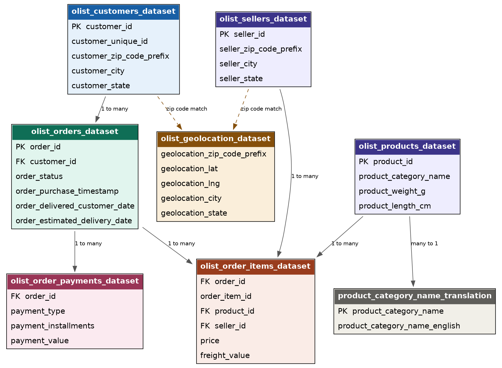
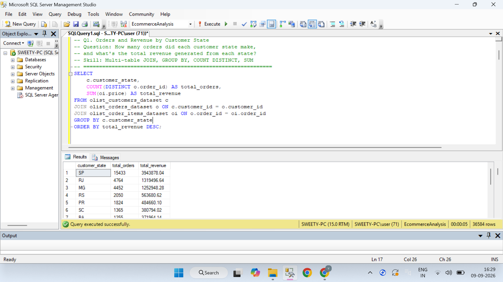
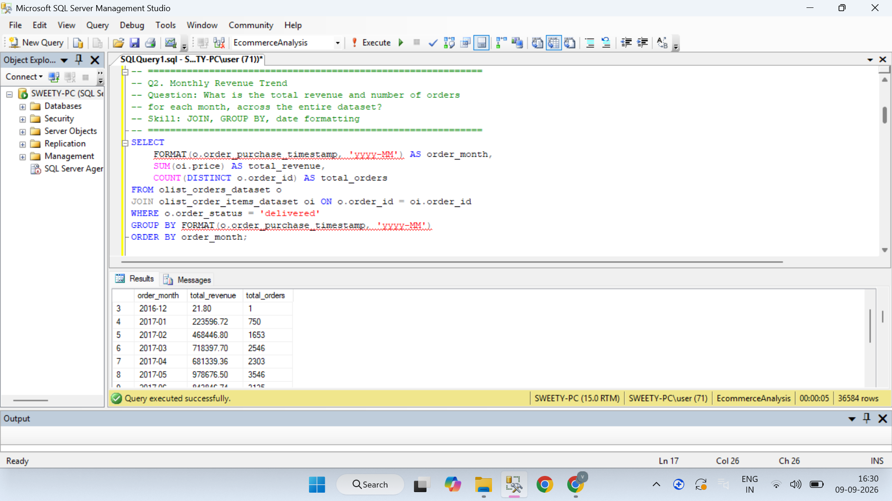
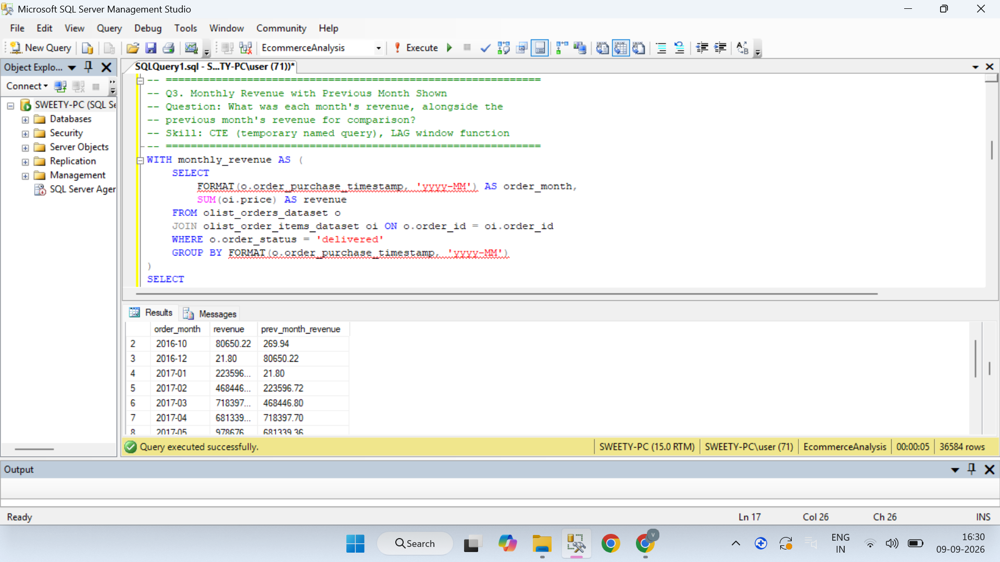
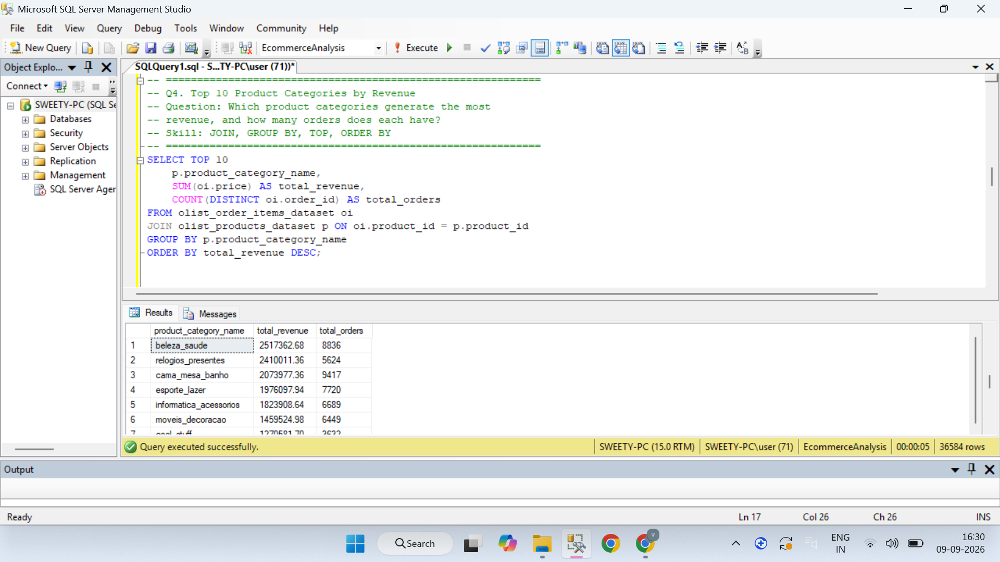
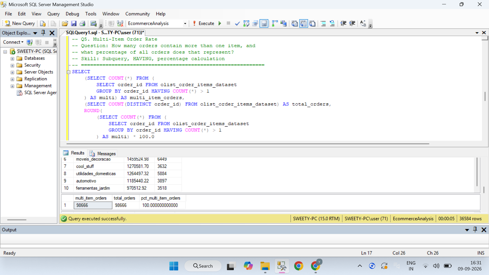
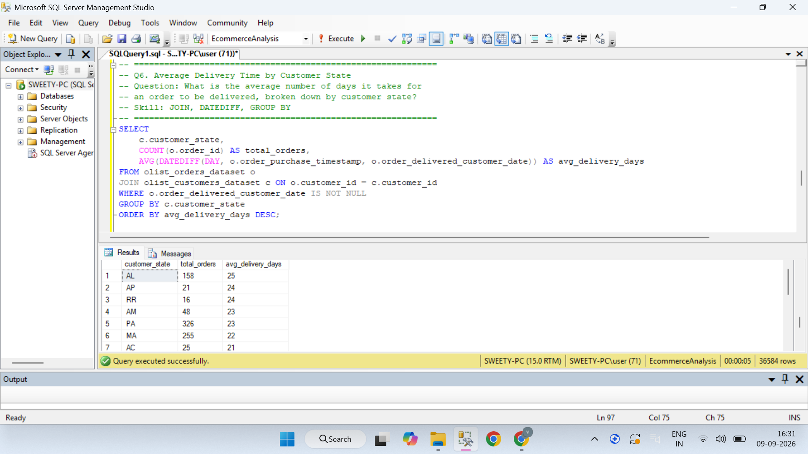
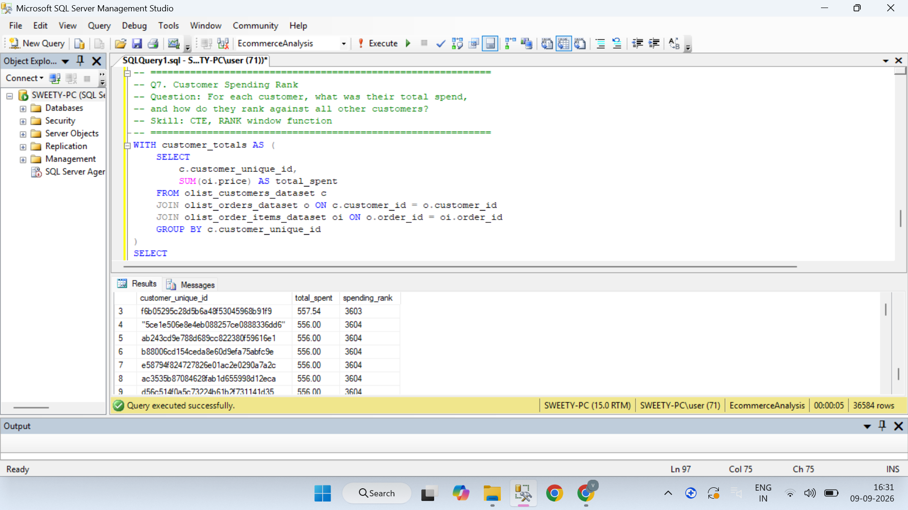

# E-Commerce Sales & Customer Analysis (SQL Server)

Analysis of the Olist Brazilian E-Commerce dataset using SQL Server (T-SQL) to uncover revenue trends, customer value, delivery performance, and retention patterns across 99,000+ orders.

## Overview

This project explores a real, multi-table e-commerce dataset to answer practical business questions a data analyst would be asked to investigate: Is revenue growing? Who are our most valuable customers? Where are we losing time in delivery? Are customers coming back?

## Tools Used

- **SQL Server / T-SQL** — all analysis, joins, and aggregation
- **SSMS** (SQL Server Management Studio) — query execution and data import
- **Olist Brazilian E-Commerce Public Dataset** (Kaggle) — source data

## Dataset Summary

| Table | Rows |
|---|---|
| Customers | 99,442 |
| Orders | 99,441 |
| Order Items | 225,300 |
| Payments | 207,772 |
| Products | 32,951 |
| Sellers | 3,095 |
| Geolocation | 1,000,163 |
| Category Translation | 71 |

## Database Schema

## Key Findings

- **Revenue by state:** São Paulo (SP) is Olist's dominant market, generating $3.94M in revenue across 15,433 orders — more than 3x the next-highest state (Rio de Janeiro at $1.3M) — highlighting significant revenue concentration in Brazil's most populous state.

### Revenue by State

### Monthly Revenue

### Growth Rate

### Top Product Categories

### Multi Item Order

### Delivery Time

### Customer Spending Ranking

## Skills Demonstrated

- Multi-table JOINs (up to 3 tables)
- Aggregation (`SUM`, `AVG`, `COUNT DISTINCT`)
- Window functions (`LAG`, `RANK`, `OVER()`)
- CTEs (Common Table Expressions)
- Subqueries
- `HAVING` clause for group-level filtering
- Date/time functions (`DATEDIFF`, `FORMAT`)
- Handling real-world data quality issues during import

## Project Files

See the `sql/` folder for all queries and table setup scripts.

## Dataset Source

This project uses the [Olist Brazilian E-Commerce Public Dataset](https://www.kaggle.com/datasets/olistbr/brazilian-ecommerce) from Kaggle.
